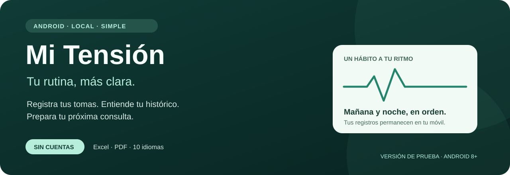
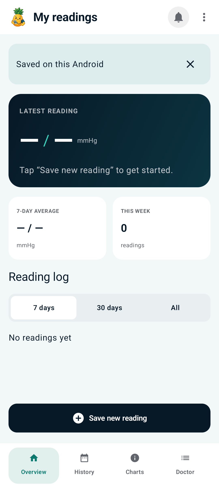
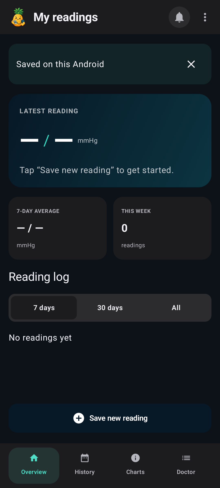
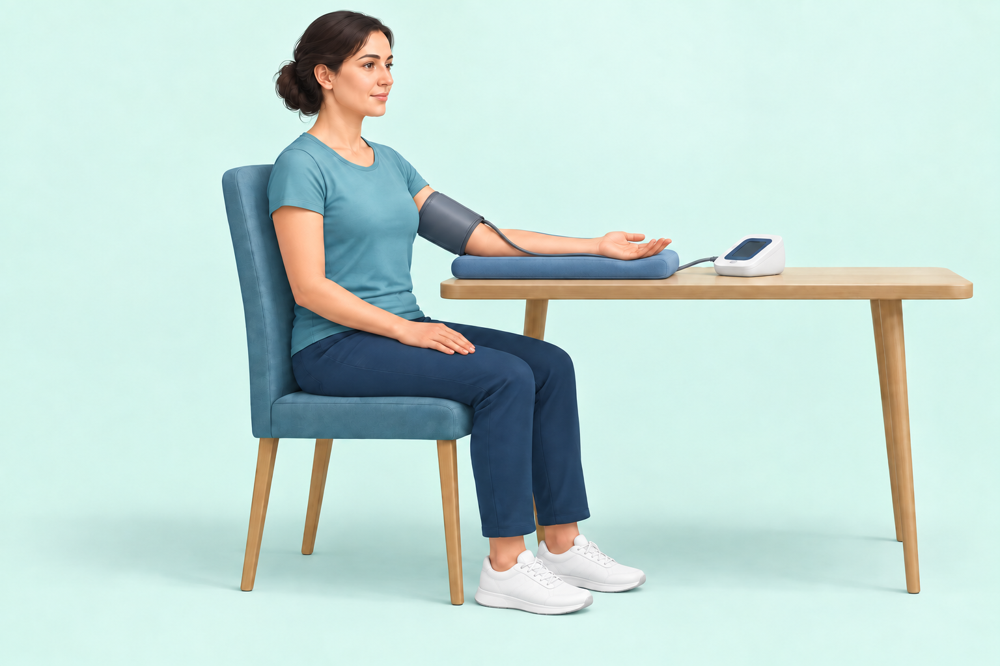
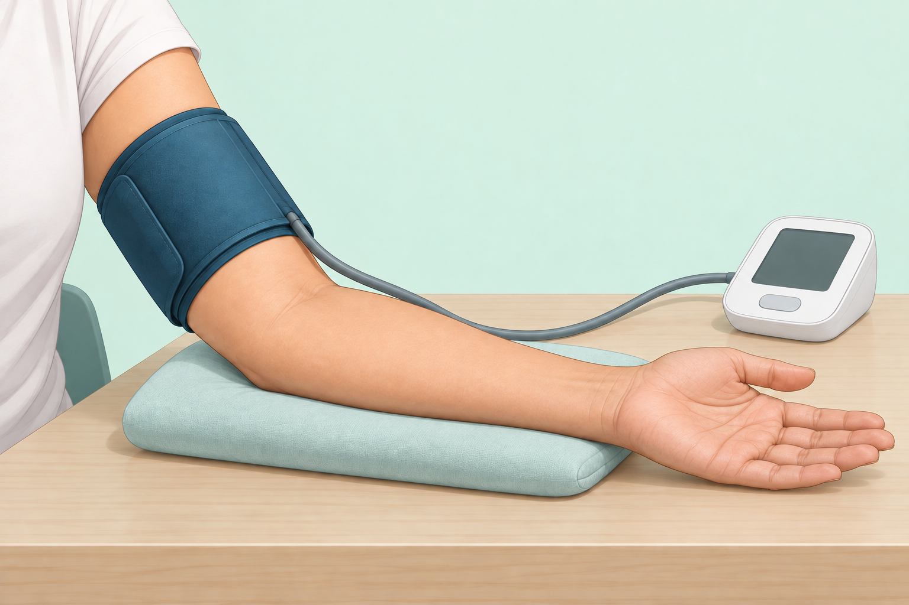

# Mi Tensión para Android

Registra las lecturas de tu tensiómetro, consulta tu evolución y prepara un informe para tu próxima visita médica. **Sin cuentas, sin publicidad y con almacenamiento local.**

**[Descargar APK 1.0.2](https://github.com/webcvalejandropina-ui/mitension-android/releases/download/v1.0.2-preview/Mi-Tension-Android-1.0.2-preview.apk)** · [Instalación](docs/INSTALLATION.md) · [Notas de versión](docs/RELEASE_1.0.2.md)

Android 8 o posterior · Kotlin y Jetpack Compose · Versión de prueba

> La app registra lecturas de un tensiómetro externo; el teléfono no mide la presión arterial. No sustituye la atención sanitaria. El APK utiliza firma de desarrollo y todavía no está publicado en Google Play.

## Qué puedes hacer

- **Registrar cada toma:** una o tres lecturas, pulso, notas y medicamentos asociados.
- **Consultar tu histórico:** agrupación por día y mañana/noche, filtros y navegación horizontal.
- **Ver tu evolución:** última toma, promedio de siete días y gráficas.
- **Preparar una consulta:** vista médica por periodo, informe PDF e impresión.
- **Conservar tus registros:** exportación e importación Excel compatible con el formato iOS.
- **Organizar tu rutina:** horarios semanales y segundo aviso a los 30 minutos si falta la toma.

## La aplicación

  
  &nbsp;
  

*Modo claro y oscuro. Capturas de la versión 1.0.1 en Android TV API 34 configurado con proporciones de teléfono, sin datos de pacientes. La descarga incluye las mejoras de lectura de la versión 1.0.2. La validación en un teléfono Android real sigue pendiente.*

### Guía ilustrada

  
  

Ilustraciones incluidas en la app y ampliables al tocarlas. No son capturas de la interfaz.

## Tus datos, en tu móvil

Las tomas **sí se guardan localmente**, pero no se envían a servidores propios. La app no solicita permiso de Internet y no incluye copia automática en la nube. Las lecturas guardadas solo se pueden eliminar, no editar. Guarda una copia Excel si necesitas respaldo y revisa los informes antes de compartir información de salud.

Disponible en español, inglés, francés, alemán, italiano, portugués, catalán, chino simplificado, japonés y árabe, siguiendo el idioma del dispositivo.

[Privacidad y almacenamiento](docs/PRIVACY.md) · [Formato de importación Excel](docs/EXCEL.md)

## Estado del proyecto

La versión 1.0.2 compila y supera once tests unitarios y lint sin errores. Se revisó visualmente con datos ficticios en claro y oscuro. La versión 1.0.1 superó seis pruebas instrumentadas; esa batería no se ha repetido en la 1.0.2.

Pendientes las pruebas en teléfono real, accesibilidad, RTL y notificaciones/alarma en condiciones reales. Los avisos requieren permisos y están sujetos a las restricciones de Android. No detectan emergencias.

[Pruebas y limitaciones](docs/VERIFICATION.md) · [Diseño basado en iPhone](docs/DESIGN_PARITY.md)

## Desarrollo y documentación

Proyecto Android independiente: no necesita ni modifica la app iOS o la web.

- [Compilar, probar y estructura del proyecto](docs/DEVELOPMENT.md)
- [Dependencias y versiones](docs/DEPENDENCIES.md)
- [Instalación, firma y actualización](docs/INSTALLATION.md)
- [Formato Excel](docs/EXCEL.md)
- [Privacidad](docs/PRIVACY.md)
- [Verificación](docs/VERIFICATION.md)

Para comunicar un fallo, abre una [incidencia](https://github.com/webcvalejandropina-ui/mitension-android/issues) indicando versión de la app, Android y pasos para reproducirlo. No publiques registros médicos ni capturas con datos personales.
