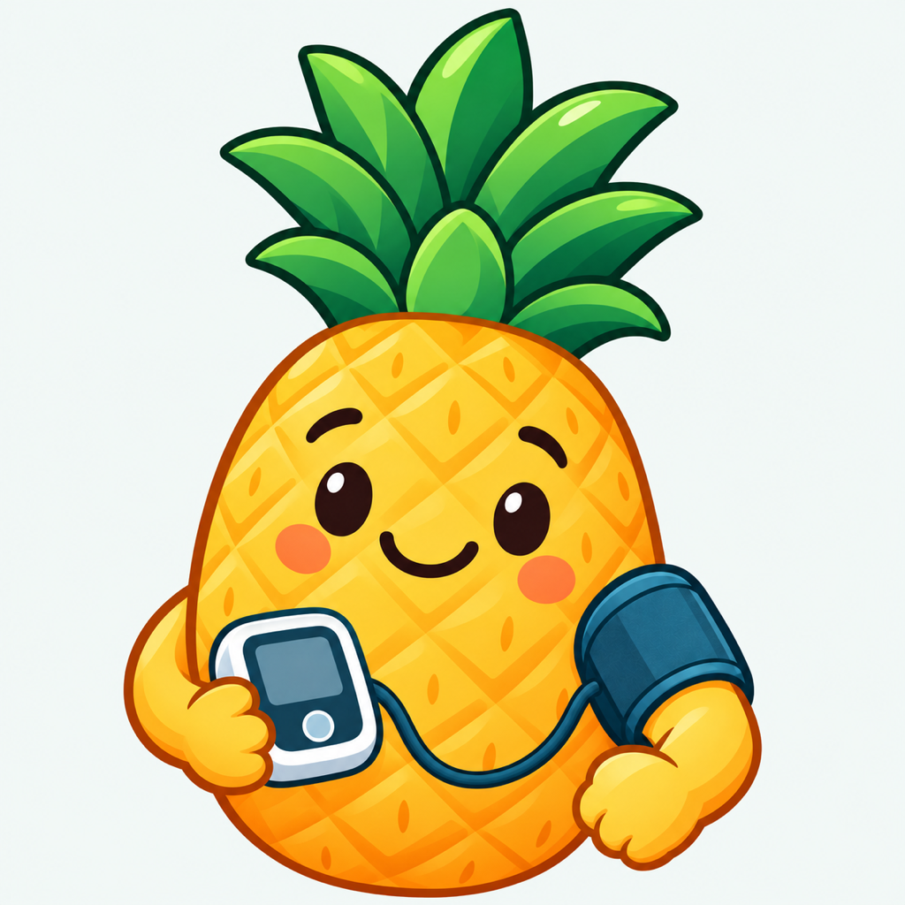

<p align="center">
  
</p>


<p align="center">
  <strong>Tu seguimiento de tensión, sin complicaciones.</strong><br />
  Registra tus lecturas, acompaña tu rutina y lleva un histórico claro a tu próxima consulta.
</p>

<p align="center">
  <a href="https://github.com/webcvalejandropina-ui/mitension-android/releases/download/v1.0.1-preview/Mi-Tension-Android-1.0.1-preview.apk"><strong>Descargar APK para Android</strong></a>
  · <a href="docs/INSTALLATION.md">Cómo instalar</a>
  · <a href="docs/PRIVACY.md">Privacidad</a>
</p>

# Mi Tensión — Android

Una app nativa en Kotlin y Jetpack Compose para organizar las lecturas de tu tensiómetro. **Sin cuentas, sin publicidad y sin servidores propios.** Tus registros se guardan en el móvil y tú decides cuándo exportarlos o compartirlos.

> **Versión de prueba disponible.** Android 8 o posterior. La app registra lecturas de un tensiómetro externo: el teléfono no mide la presión arterial. No sustituye el consejo de un profesional sanitario.

## De la toma a la consulta

| Tu día a día | Lo que puedes hacer |
| --- | --- |
| Registrar con comodidad | Una o tres tomas, pulso, notas y medicamentos asociados a cada lectura. |
| Ver todo en orden | Histórico agrupado por día y mañana/noche, con navegación horizontal. |
| Entender tu evolución | Gráfica de las últimas 60 lecturas y referencias orientativas explicadas. |
| Preparar tu consulta | Vista médica, PDF para compartir e impresión desde Android. |
| Conservar una copia | Exportar e importar Excel, compatible con el formato de la app iOS. |
| Cuidar tu rutina | Horarios configurables y segundo aviso a los 30 minutos si falta la toma. |

## Una guía que también se ve

### Android: modo claro y oscuro

<p align="center">
  
  
</p>

*Capturas reales de la versión 1.0.1 en el emulador Android TV API 34 ajustado a proporciones de teléfono. Sin registros de pacientes. No sustituyen una revisión en un móvil Android real.*

### Ilustraciones de la guía

<p align="center">
  
  
</p>

*Ilustraciones incluidas en la guía de la aplicación; no son capturas de la interfaz.* Puedes ampliarlas dentro de la app para consultar los detalles.

## A tu idioma y a tu ritmo

Modo claro y oscuro, guía ilustrada y diez idiomas según el dispositivo: español, inglés, francés, alemán, italiano, portugués, catalán, chino simplificado, japonés y árabe. No requiere registro ni pagos.

Los datos no se envían a servidores propios: la app no solicita permiso de Internet. **Sí se guardan localmente en el dispositivo.** Las exportaciones contienen información de salud; compártelas solo cuando quieras y con quien corresponda.

## Descargar e instalar

[Repositorio Android](https://github.com/webcvalejandropina-ui/mitension-android) · [APK y versión de prueba](https://github.com/webcvalejandropina-ui/mitension-android/releases/tag/v1.0.1-preview)

El APK publicado es instalable en Android 8 o posterior y está firmado para pruebas (Debug). No es una versión certificada para producción ni una publicación en Google Play. Consulta [instalación, firma y actualización](docs/INSTALLATION.md) y [pruebas realizadas y pendientes](docs/VERIFICATION.md).

## Funciones

El diseño Android toma como referencia la app iPhone: paleta adaptable, última toma, métricas y navegación inferior. Consulta los [criterios de diseño compartidos](docs/DESIGN_PARITY.md).

- Formulario de una o tres tomas, con UUID individual, pulso, notas y medicamentos por toma.
- Cada toma se guarda en el móvil; el lote se valida antes de una escritura atómica. Las tomas guardadas no se editan, solo se eliminan con confirmación.
- Menú horizontal con Resumen, Histórico, Gráficas y Médico; agrupación por fecha local y mañana/noche (corte a las 14:00).
- Gráfica de las últimas 60 tomas, vista médica, PDF compartible e impresión nativa.
- Exportación/importación `.xlsx`, compatible con el formato iOS: cada fila es una toma, admite 1/2/3 por periodo o más, deduplica UUID y rechaza archivos inválidos completos.
- Guía ilustrada ampliable, referencias orientativas y privacidad. Aviso de almacenamiento cerrable permanentemente.
- Horarios semanales guardados localmente, segundo aviso a los 30 minutos si falta la toma del día/periodo, alarma sonora opcional con acción Detener y límite de cinco minutos.
- Colores claros/oscuros y recursos para español, inglés, francés, alemán, italiano, portugués, catalán, chino simplificado, japonés y árabe según el dispositivo.

## Requisitos

Proyecto Android **independiente** de iOS y de la web. Incluye sus propias carpetas, recursos y dependencias; no necesitas los otros proyectos para compilar.

- Android Studio compatible con AGP 8.13.2, o SDK/CLI Android.
- JDK 17 para Gradle; wrapper **Gradle 8.13** con checksum de distribución.
- SDK Android 36 y Build Tools 35.0.0.
- Android 8.0/API 26 o posterior en el dispositivo.

Abre **esta carpeta** en Android Studio, configura el SDK y Gradle JDK 17 y ejecuta `app`. `local.properties` contiene la ubicación del SDK de cada desarrollador y está excluido de Git. No requiere Node ni dependencias iOS.

En este Mac, el JDK 17 está instalado mediante Homebrew pero el lanzador Java del sistema no lo detecta automáticamente. Para ejecutar los comandos desde Terminal, configura antes la sesión (no cambia la configuración de iOS):

```sh
export JAVA_HOME="$(brew --prefix openjdk@17)/libexec/openjdk.jdk/Contents/Home"
```

En otras máquinas, utilizar la ruta de su propio JDK 17. No guardar rutas personales en `gradle.properties` compartido.

```sh
./gradlew :app:assembleDebug :app:testDebugUnitTest :app:lintDebug
./gradlew :app:assembleRelease

# Con un dispositivo/emulador Android conectado:
./gradlew :app:connectedDebugAndroidTest
adb install -r app/build/outputs/apk/debug/app-debug.apk
adb shell am start -n com.example.mitension/.MainActivity
```

`assembleRelease` genera un APK **sin firma de distribución**. No es un lanzamiento aprobado para Google Play. El application ID es de ejemplo; elegir uno propio y firma privada antes de publicar. Nunca incluir keystores, claves, exportaciones médicas ni históricos en Git.

## Carpetas y documentación

- `app/src/main/java/.../model/`: validación, agrupación y planificación pura de avisos.
- `.../data/`: almacén atómico, ZIP/XML Excel, PDF y adaptador de impresión.
- `.../reminders/`: AlarmManager, receivers, configuración y servicio sonoro.
- `MainActivity.kt`, `Tools.kt`, `Texts.kt`: navegación, formularios, guía, idiomas y ajustes.
- `app/src/main/res/`: diez idiomas, estilos, imágenes y rutas restringidas de compartir.
- `app/src/test/`: regresiones JVM con datos sintéticos.
- `app/src/androidTest/`: almacenamiento aislado y navegación Compose, sin conceder permisos de avisos.
- `gradle/`: wrapper reproducible; `docs/`: [dependencias](docs/DEPENDENCIES.md), [formato Excel](docs/EXCEL.md), [privacidad](docs/PRIVACY.md) y [verificación](docs/VERIFICATION.md).

## Avisos y límites de Android

Los permisos no se conceden automáticamente. Guardar horarios conserva la configuración aunque se deniegue el permiso. Desde Android 13 se solicita permiso de notificaciones al guardar horarios activados. Desde Android 12, el permiso especial de alarmas exactas se concede desde Ajustes; sin él, los avisos pueden retrasarse y no se activa sonido continuo de alarma.

La app planifica la próxima ocurrencia y el próximo segundo aviso, no un horizonte de 21 días. Cada entrega renueva las siguientes; arranque, cambios de hora/zona y reapertura también reconcilian la planificación. Forzar detención puede impedir avisos hasta reabrir. La alarma usa un servicio visible con acción Detener; depende del volumen de alarmas y la configuración del fabricante. No detecta emergencias ni mediciones elevadas para activar alarmas.

## Fuentes técnicas y sanitarias

- [Compatibilidad oficial de AGP 8.13](https://developer.android.com/build/releases/agp-8-13-0-release-notes)
- [Compose BOM](https://developer.android.com/develop/ui/compose/bom)
- [Alarmas y permisos de Android](https://developer.android.com/develop/background-work/services/alarms)
- [Medición domiciliaria, American Heart Association](https://www.heart.org/en/health-topics/high-blood-pressure/understanding-blood-pressure-readings/monitoring-your-blood-pressure-at-home)

Las referencias de presión son orientativas para adultos, no diagnóstico ni objetivos terapéuticos personales. No se aplican al embarazo ni a menores. Se recomienda revisión clínica, lingüística, accesibilidad y pruebas reales de teléfono antes de producción.
